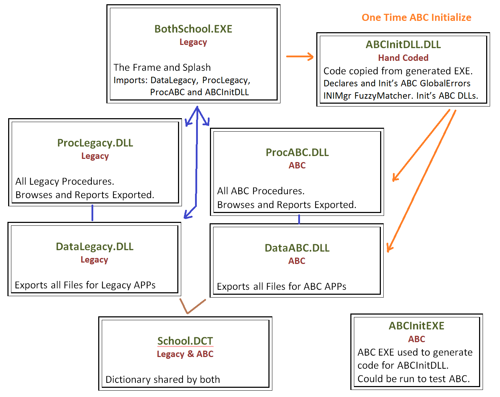
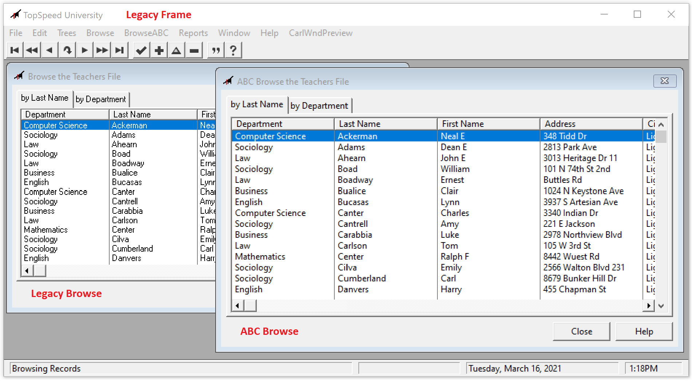

## Legacy and ABC Coexisting

If your solution is Legacy based you could use this method to add new functionality and take advantage of ABC.
 This example of a Legacy based solution using ABC by having separate ABC DLL's including a Data DLL with the classes.
 This is ABC "coexisting in isolation" from Legacy. 

Legacy can call ABC but not the opposite. Legacy cannot share GlobalRequest/GlobalResponse without more work,
 but I'm sure it can be done. The advantage of this approach is it takes no template modifications.
  It does take one hand coded DLL to initialize the ABC classes. The code for that is copy / pasted
   from an ABC APP that generates the EXE.

The School Example from CW 2.0 was used to create the Legacy Frame EXE and split to make Procedure and Data DLLs.
 The ABC based School APP from C9 was split to create Procedure and Data DLLs.
  So all procedures exist in both Legacy and ABC forms. The Frame has an ABC menu.
   ABC browse windows use a larger Segoe font, and the caption says "ABC", so are obvious.

Shown during the ClarionLive Open Webinar:

  * [ClarionLive Open Webinar March 17, 2021 at time 33:00](https://www.youtube.com/watch?v=SX3OJWlGoxs&t=33m00s)
  
  * [ClarionLive Open Webinar March 31, 2021 at time 56:10](https://www.youtube.com/watch?v=l5933Tuq4UI&t=56m10s)
